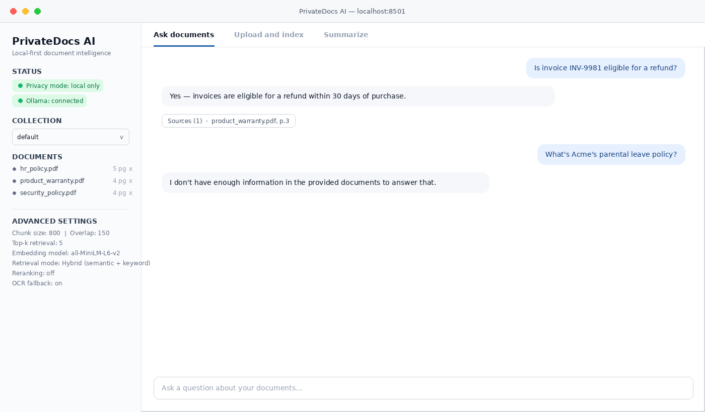
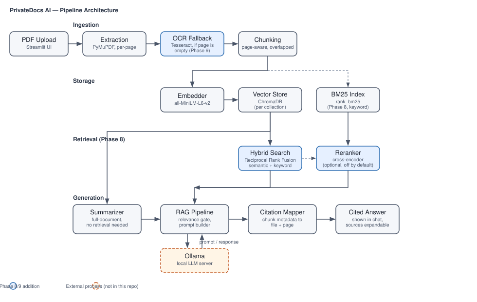

# PrivateDocs AI

Local-first document intelligence: upload PDFs, index them locally, ask
questions, get grounded answers with page citations, and generate
summaries — all without documents ever leaving your machine.

**Status: Phases 0–11 complete (through Section 15 of the PRD).** The full
MVP loop works end to end: upload → index → ask → cited answer →
summarize, with hybrid keyword+semantic retrieval (Phase 8), OCR fallback
for scanned PDFs (Phase 9), a documented evaluation suite (Phase 10), and
Docker packaging + a polished repo (Phase 11). All 11 phases from the PRD
are done.


*This is a mockup built from the real UI code, not a live screen capture —
this environment has no network access to Ollama or Hugging Face to
actually run the app. See "Screenshots" below for why, and swap in a real
capture once you're running it locally.*

### Phase 8: advanced retrieval

- **Hybrid search** (on by default, `ENABLE_HYBRID_SEARCH`): every query
  runs through both semantic (embedding) search and BM25 keyword search,
  merged with Reciprocal Rank Fusion. This catches exact terms — invoice
  numbers, names, acronyms — that pure embedding search sometimes blurs
  past. No extra model or network call.
- **Cross-encoder reranking** (off by default, `ENABLE_RERANKING`): an
  optional second pass that re-scores the top hybrid candidates with a
  more accurate (but slower) cross-encoder model before answering. Turn
  it on if you have documents where the top-k hybrid results are close
  calls; it downloads its own small model from Hugging Face on first use.
- Tunable via `.env`: `TOP_K`, `HYBRID_CANDIDATE_K`, `RRF_K`,
  `RERANK_CANDIDATE_K` — see `.env.example` for defaults and what each
  one does.

### Phase 9: OCR & difficult documents

- **Scanned-page detection** (unchanged from Phase 2): a page with no
  extractable text layer is flagged, then (Phase 9) gets an automatic
  OCR pass before being counted as genuinely unreadable.
- **OCR fallback** (on by default, `ENABLE_OCR`): uses PyMuPDF to
  rasterize the page (no extra system dependency for that part) and
  Tesseract to read it. Requires the Tesseract engine itself — see
  Setup step 2a below. If it's not installed, OCR is skipped
  automatically and you get a clear, actionable error instead of a
  crash or a silent empty result.
- **Page references are preserved exactly**: an OCR'd page keeps its
  real page number, so citations for scanned pages are just as
  trustworthy as citations for text-layer pages. Verified with a mixed
  real-text/scanned/real-text document in the test suite.
- **Known limitation**: Tesseract extracts text linearly - a table
  becomes a wall of text, not preserved rows/columns. Good enough to
  find and cite table content, not good enough to reconstruct the
  table's structure. Multi-column layouts have the same caveat (reading
  order isn't guaranteed to follow the columns correctly). Tune
  `OCR_DPI` upward (e.g. 400-600) for small print, at the cost of speed.
- Tunable via `.env`: `ENABLE_OCR`, `OCR_LANGUAGE`, `OCR_DPI`.

### Phase 10: evaluation

- **60 evaluation questions** in `evaluation/dataset/questions.json`
  against a small synthetic 4-document / 17-page corpus (generated by
  `evaluation/dataset/generate_dataset.py` — a fictional company's HR
  policy, product warranty, financial report, and security policy).
  Every question's ground truth (which document/page contains the
  answer, and what keywords a correct answer must contain) was
  cross-checked against the actual generated PDF text, not just written
  by hand and assumed correct. 35 known-answer questions, 15
  deliberately unanswerable ones (nothing in the corpus covers them),
  and 10 cross-document questions requiring facts from two different
  files.
- **Run it yourself:** `python evaluation/run_eval.py` — indexes the
  corpus into a throwaway ChromaDB collection (never touches your real
  `data/vector_store`), runs all 60 questions, and writes a full
  per-question breakdown plus a summary to `evaluation/results/`.
  Works without Ollama running (retrieval-only metrics), and picks up
  full generation-based metrics automatically if Ollama is running -
  no flag needed either way. Options: `--top-k`, `--no-hybrid`,
  `--rerank`, `--retrieval-only`.
- **Metrics measured** (`evaluation/metrics.py`, unit-tested in
  isolation): retrieval precision/recall against known-correct
  (document, page) pairs; citation correctness (do citations point to a
  real source for that question); a **groundedness proxy** — whether
  the answer contains the factual keywords it needed to, or correctly
  declined when it should have; decline accuracy on the no-answer
  questions; and retrieval/answer latency (p50/p95).
- **Honest limitation on groundedness**: this is a keyword-presence
  proxy, not an LLM-as-judge fact-check or a human review. It catches
  the common failure modes (hallucinated numbers, dodged questions,
  fabricated answers to no-answer questions) but a model could in
  principle include the right keywords while still misrepresenting the
  source in some other way this proxy wouldn't catch. Said plainly here
  rather than glossed over.
- **Demo run in this repo** (`evaluation/results/`): since this
  environment has no network access to Ollama or Hugging Face, the
  results checked in were produced with a deterministic bag-of-words
  stand-in embedder instead of the real one — enough to prove the
  harness's mechanics (indexing, retrieval, metric computation, hybrid
  vs. semantic-only comparison) work correctly end to end, but **not
  representative of real embedding-model retrieval quality.** Notably,
  the hybrid-vs-semantic-only comparison in that demo run shows no
  difference — that's because the stand-in embedder is itself just
  word-counting, so it's redundant with BM25 rather than complementary
  to it, which defeats the point of the comparison. A real embedding
  model captures paraphrases and synonyms that lexical matching misses,
  which is precisely where hybrid search is expected to help. **Re-run
  `python evaluation/run_eval.py` yourself with Ollama running** (Setup
  steps 1–2) to get real numbers — the harness downloads the real
  embedding model automatically, same as normal indexing does.

### Phase 11: testing, packaging & release

- **Tests**: 132 tests total — unit tests per module, plus a dedicated
  `tests/test_integration.py` covering the four end-to-end flows the PRD
  calls out explicitly (upload → extraction → indexing; question →
  retrieval → generation → citations; summary generation; multiple-
  document collections), each wiring real components together rather
  than mocking every neighbor.
- **A real bug found and fixed during this phase**: the live Streamlit
  UI was still hardcoding plain semantic-only search for its RAGPipeline,
  even after Phase 8 built hybrid search and reranking — meaning the
  running app never actually benefited from either, despite both being
  fully implemented and tested in isolation. Fixed, and
  `tests/test_ui_wiring.py` now locks in the fix so it can't silently
  regress again.
- **"Clean machine" testing**: every `.py` file in the project
  compile-checks cleanly; the full pinned `requirements.txt` resolves
  with no dependency conflicts (`pip check` and a dependency-resolution
  dry run both pass). A genuine fresh-virtualenv reinstall wasn't
  possible in the sandbox this was built in (disk constraints), so this
  is the closest verification available here — if you hit an install
  issue on your machine that this didn't catch, please open an issue.
- **Docker packaging** (optional, per the PRD): `Dockerfile` +
  `docker-compose.yml`, described below. Tesseract is included in the
  image so OCR works out of the box. **Honest caveat**: this
  environment has no Docker daemon available, so the image has been
  carefully reviewed line-by-line and its concrete pieces individually
  verified (the Streamlit CLI flags and `/_stcore/health` endpoint used
  in the Dockerfile were checked against the actual installed Streamlit
  version; the dependency install step was checked via the dry run
  above) — but it has **not been through an actual `docker build`**.
  Please try it and report back if something doesn't work.
- **Screenshots**: `docs/screenshots/` and `docs/architecture.svg` are
  real files in this repo, not just chat output — but for the same
  reason as the Docker caveat, the UI screenshot is a pixel-accurate
  mockup built from the real `streamlit_app.py` code, not a live screen
  capture. Replace it with a real one once you're running the app.

## Docker

Optional, per the PRD (Section 15, Phase 11 lists this as optional).
Ollama itself is **not** containerized by default — most people already
have it running on their host machine, and this keeps the image small
and avoids guessing at GPU passthrough configuration that varies a lot
by platform.

```bash
# 1. Make sure Ollama is running on your host machine (see Setup step 1-2 below)
ollama serve

# 2. Build and run the app container
docker compose up --build
```

The app will be reachable at `http://localhost:8501`. Documents and the
vector store persist in `./data` on your host (mounted as a volume), so
they survive a container rebuild.

If you'd rather run Ollama in its own container too, `docker-compose.yml`
has that option commented out with instructions - see the file itself.

Config (top-k, hybrid search, reranking, OCR, etc.) is passed through as
environment variables in `docker-compose.yml`, reading the same `.env`
conventions as running the app directly - see `.env.example` for the
full list.

## Troubleshooting

**"Ollama connection refused" / red status in the sidebar**
Make sure `ollama serve` is running in its own terminal (Setup step 2).
If you're in Docker, check `OLLAMA_HOST` is reachable from inside the
container — on Linux this needs the `extra_hosts` entry in
`docker-compose.yml`, already included by default.

**First PDF upload is slow / seems to hang**
Expected the very first time: the embedding model (~80MB) downloads
from Hugging Face on first use. Needs internet for that one time only;
everything after is fully offline. Check your terminal for download
progress.

**"This looks like a scanned PDF, and OCR couldn't run..."**
Tesseract isn't installed. See Setup step 2a, or set `ENABLE_OCR=false`
in `.env` if you don't need OCR and just want the error to say so more
plainly.

**Tests fail on a fresh clone**
Run `pip install -r requirements.txt` first (obvious, but the most
common cause). If a specific test fails and it's not obviously
environment-related, please open an issue with the full `pytest -v`
output.

**Answers seem to ignore an obviously-relevant document**
Check the sidebar's "Collection" dropdown — documents are scoped per
collection, and a question only searches the currently-selected one.
Also check `.env`'s `TOP_K` and the relevance threshold constants in
`app/generation/rag_pipeline.py` if answers are being declined when
they shouldn't be (see that file's comments on tuning them for your
actual embedding model/corpus).

## Setup

1. **Install Ollama** (if you haven't already): https://ollama.com
2. **Pull the model:**
   ```bash
   ollama pull llama3.1:8b
   ollama serve
   ```
   (leave this running in a terminal - it's the local LLM server)

2a. **Install Tesseract** (for OCR on scanned PDFs - optional but recommended):
   ```bash
   # macOS
   brew install tesseract
   # Ubuntu/Debian
   sudo apt-get install tesseract-ocr
   # Windows: https://github.com/UB-Mannheim/tesseract/wiki
   ```
   If you skip this, the app still works fine for normal (non-scanned)
   PDFs - scanned documents will just get a clear "install Tesseract"
   error instead of being indexed.
3. **Set up the Python environment:**
   ```bash
   cd PrivateDocs-AI
   python3 -m venv venv
   source venv/bin/activate   # Windows: venv\Scripts\activate
   pip install -r requirements.txt
   ```
4. **Copy the env file:**
   ```bash
   cp .env.example .env
   ```
   Defaults should work as-is. Adjust `OLLAMA_MODEL` if you pulled a
   different model.
5. **Run the tests** (132 tests, should all pass in under 20 seconds):
   ```bash
   pytest tests/ -v
   ```
6. **Launch the app:**
   ```bash
   python run.py
   ```
   This opens the Streamlit UI in your browser (usually `localhost:8501`).
7. **(Optional) Run the evaluation suite** to see retrieval/answer
   quality metrics against a real corpus:
   ```bash
   python evaluation/run_eval.py
   ```
   See the "Phase 10: evaluation" section above for what it measures.

## First run notes

- The **first time** you upload a PDF, `sentence-transformers` will
  download the embedding model (~80MB) from Hugging Face. This needs
  internet access once; after that, everything runs fully offline.
- Check the sidebar's Ollama status indicator - if it's red, make sure
  `ollama serve` is running in another terminal.
- Try uploading 1-2 PDFs first, ask a question you know the answer to,
  and check that the citation (filename + page number) actually points
  to the right place.

## What to test / feedback that's useful

- Does a real question against a real PDF return a sensible, grounded
  answer with a correct page citation?
- Does the app correctly decline ("I don't have enough information...")
  when you ask something unrelated to the uploaded documents?
- How does answer quality feel with `llama3.1:8b`? If it's slow or the
  quality feels off, that's useful signal for whether to try a smaller
  or larger model.
- Any UI rough edges in the Upload / Ask / Summarize tabs.

## Architecture



## Project structure

See `app/` for the pipeline modules (ingestion, embeddings, storage,
retrieval, generation, citations, ui, config) and `tests/` for the test
suite (132 tests as of this point, covering every module above except
the parts requiring live Ollama/Hugging Face network access, which are
tested with mocks/fakes instead).
